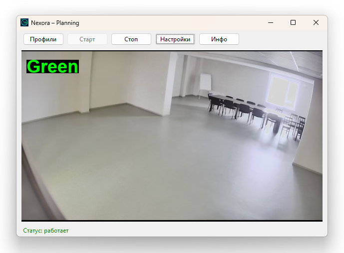

# Nexora — Простая система видеонаблюдения с детекцией движения


**Nexora** — это легковесное приложение на Python для подключения к IP-камерам или веб-камерам с возможностью обнаружения движения в реальном времени.

> 💡 Поддерживает RTSP, HTTP-потоки и встроенную веб-камеру (через `0`).

---

## 🖼️ Скриншот




---

## ✨ Возможности

- Подключение к IP-камере по RTSP или прямому URL
- Детекция движения с настраиваемой чувствительностью
- Сохранение настроек в защищённый файл
- Простой и понятный интерфейс на Tkinter
- Журнал событий в реальном времени

---

## 🚀 Установка

1. Клонируйте репозиторий:
   ```bash
   git clone https://github.com/Hashmaster82/nexora.git
   cd nexora
   pip install -r requirements.txt
   python app.py
   
## 🚀 Запуск run.bat

\
⚙️ Настройки
При первом запуске программа создаст файл настроек:

Основной: settings.ini — в папке программы\
Секретный: ~/nexora_secret_settings.ini — содержит URL, логин, пароль
Вы можете изменить путь к секретному файлу через меню Настройки.
\
\
📦 Требования\
Python 3.7+\
OpenCV (opencv-python)\
Pillow\
tkinter (входит в стандартную библиотеку Python)\
\
📄 Лицензия\
Этот проект распространяется под лицензией MIT. Подробнее см. в файле LICENSE .\
\
👤 Автор\
Разин Г.В.


🙌 Благодарности\
OpenCV\
Pillow\
Tkinter